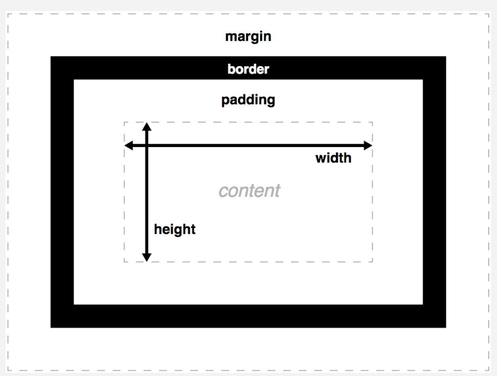

# Box model

The CSS box model is the foundation of layout on the Web — each element is represented as a rectangular box, with the box's content, padding, border, and margin built up around one another like the layers of an onion. As a browser renders a web page layout, it works out what styles are applied to the content of each box, how big the surrounding onion layers are, and where the boxes sit in relation to one another. Before understanding how to create CSS layouts, you need to understand the box model.

