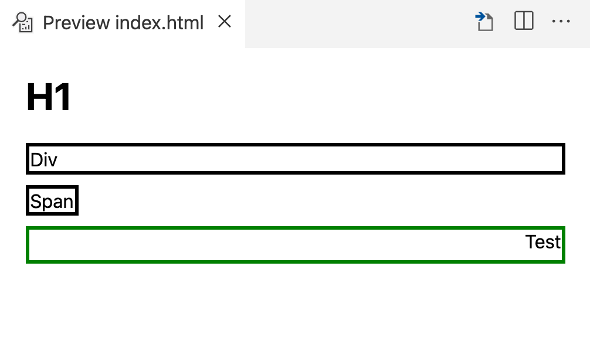

# display

Visi elementai pagal numatytuosius nustatymus turi `display` ypatybę, tačiau skiriasi priklausomai nuo elemento tipo.
* Teksto elementai (pvz., span) paprastai turi `display: inline`, o bloko elementai (pvz., div) - `display: block`.
* `inline` - reiškia, kad elementas užims tik tą vietą, kurios reikia jo turiniui.
* `block` - reiškia, kad elementas užims visą jam prieinamą plotį. Jis prasideda nuo naujos linijos/eilutės.
* Yra dar ir kitos `display` reikšmės (`inline-block`, `table`, `flex` ir `grid`), bet apie jas detaliau pašnekėsim vėliau.
* Naudojant `display` elementai gali būti pozicionuojami naudojant display kartu su float savybe, kuris gali turėti reikšmes `left` ir `right`. Tai leidžia elementą pastumti į kairę arba dešinę.

---

```html
<!DOCTYPE html>
<html>

<head>
  <style>
    [data-test=test] {
      border: medium solid;
      margin-bottom: 10px;
    }

    .positioning {
      margin-top: 10px;
      border: green medium solid;
      height: 20px;
    }
    
    .positioning > span {
      float: right;
    }
  </style>
</head>

<body>
  <h1>H1</h1>
  <!-- Block element -->
  <div data-test="test">Div</div>
  <!-- Inline element -->
  <span data-test="test">Span</span>
  <!-- Float -->
  <div class="positioning">
    <span>Test</span>
  </div>
</body>

</html>
```

---

