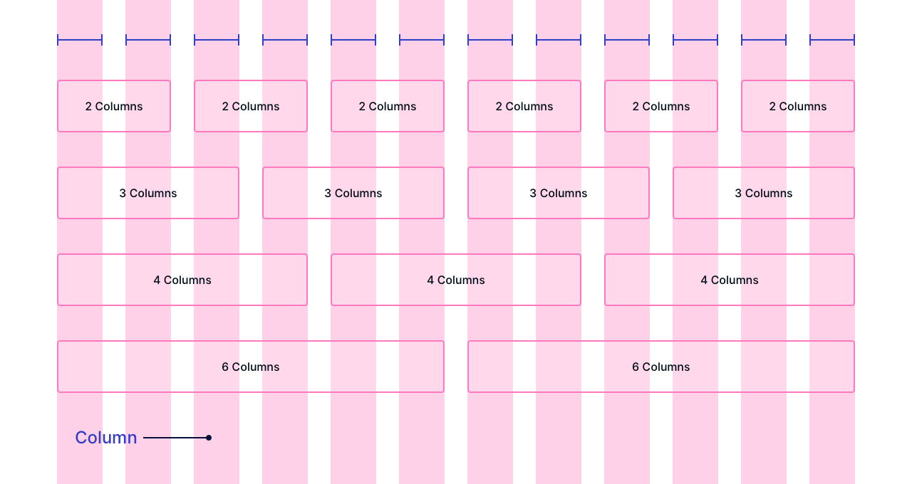

# GRID layout based on flow layout

In graphic design, a grid is a structure (usually two-dimensional) made up of a series of intersecting straight (vertical, horizontal, and angular) or curved lines (grid lines) used to structure content. The grid serves as an armature or framework on which a designer can organize graphic elements (images, glyphs, paragraphs, etc.) in a rational, easy-to-absorb manner.

How to implement such 12 column based layout?
