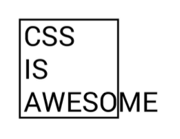

# Elementų pozicionavimas/išdėstymas (positioning)

CSS kartais gali būti šiek tiek sudėtinga suprasti, kaip tiksliai išsidėstomi puslapio elementai.

---

<div style="text-align: center">
    
</div>

```html
<div style="???">
    
</div>
```

---

* **position** CSS ypatybė/atributas nustato, kaip elementas išdėstomas dokumente. Papildomi **top**, **right**, **bottom** ir **left** atributai lemia galutinę išdėstytų elementų vietą.
* Visi html elementai turi stiliaus atributą - **position**. **position** reikšmė pagal nutylėjimą yra *static* ir tai reiškia kad elementai tiesiog išdėstomi arčiausioje laisvoje vietoje.
* **position** galimos reikšmės:
  * *static* - elementas yra išdėstytas pagal įprastą/normalų dokumento srautą/eiga (ang. flow). **top**, **right**, **bottom** ir **left** savybės neturi jokios įtakos. Tai yra numatytoji **position** reikšmė
  * *relative* - elementas yra išdėstytas pagal įprastą/normalų dokumento srautą/eigą (ang. flow) tėvinio elemento (kuriame jis yra) viršutinio kairiojo kampo atžvilgiu. Galutinę padėtį lemia **top**, **right**, **bottom** ir **left** savybės.
  * *absolute* - elementas pašalinamas iš įprastinio/normalaus dokumento srauto/eigos (ang. flow) ir puslapio išdėstyme elementui nesukuriama vietos. Jis yra išdėstomas artimiausio jo protėvio elemento atžvilgiu, jei toks yra; priešingu atveju jis išdėstomas pradinio bloko atžvilgiu (viewport). Galutinę padėtį lemia **top**, **right**, **bottom** ir **left** savybės.
  elementas išdėstomas dokumento viršutinio kairiojo kampo atžvilgiu neatsižvelgiant į kitus elementus. Jei tėvinio elemento pozicija yra relative, tai elementas su pozicija absolute yra išdėstomas tėvinio elemento viršutinio kairio kampo atžvilgiu.
  * *fixed* - elementas pašalinamas iš įprastinio/normalaus dokumento srauto/eigos (ang. flow) ir puslapio išdėstyme elementui nesukuriama vietos. Jis yra išdėstomas pradinio bloko atžvilgiu (viewport). Galutinę padėtį lemia **top**, **right**, **bottom** ir **left** savybės. Jo padėtis nekinta net kai mes 'scrolinam' puslapį
  * *sticky* (dažnai tūri būti naudojamas kartu su -webkit-sticky) - elementas yra išdėstytas pagal įprastą/normalų dokumento srautą/eigą (ang. flow). Šiuo atveju, padėtis yra "pririšta". "Scrolinant" dokumentą jo padėtis išlieka ta pati.

---

<style>
    .interactive {
        background-color: #f4f4f4;
        border: 1px solid #d5d5d5;
        color: #1b1b1b;
        padding: 10px;
        width: 100%;
    }
</style>
<iframe class="interactive" height="390" src="https://interactive-examples.mdn.mozilla.net/pages/css/position.html" title="MDN Web Docs Interactive Example" loading="lazy">
</iframe>